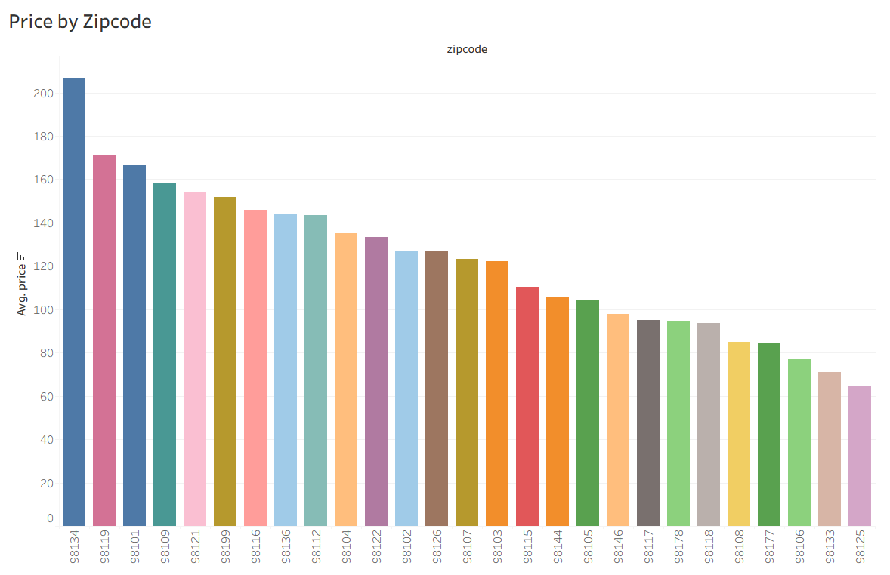
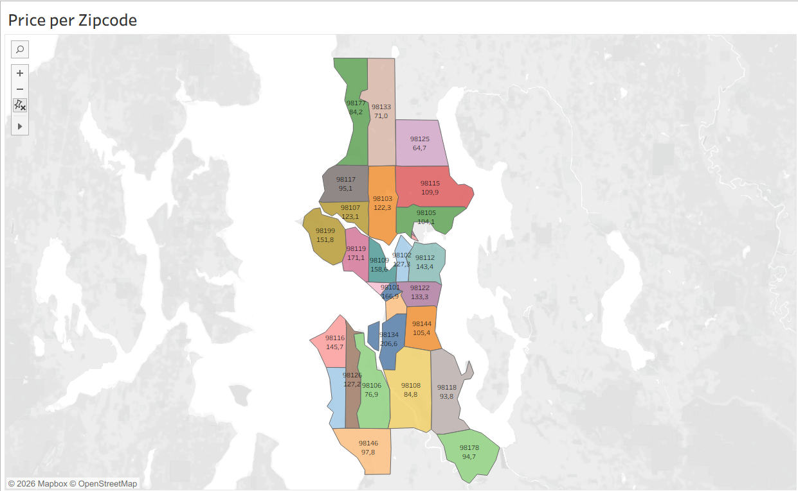
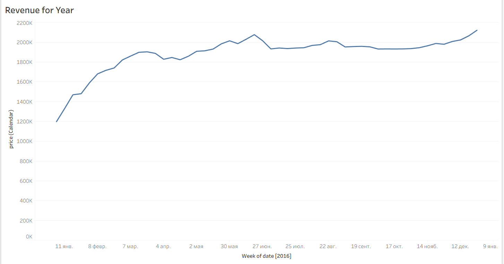
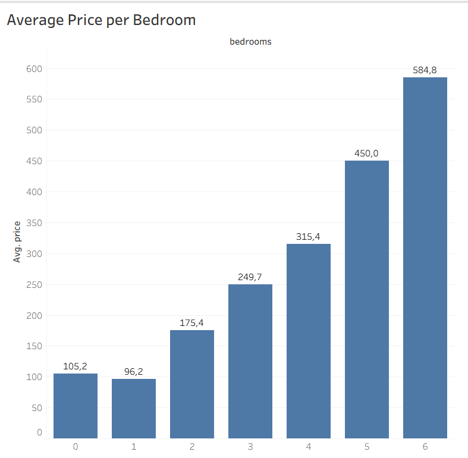
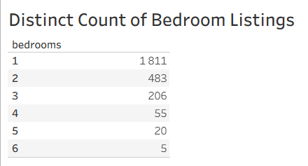

# Анализ рынка краткосрочной аренды Airbnb в Сиэтле (Tableau)

## 📌 О проекте
Данный проект представляет собой интерактивный дашборд, созданный в **Tableau**, на основе открытого датасета **Seattle Airbnb Open Data**. 

**Цель проекта:** Исследовать рынок краткосрочной аренды в Сиэтле, выявить ключевые факторы, влияющие на стоимость жилья, проанализировать географическое распределение цен и динамику выручки.

**Инструменты:** Tableau, предобработка данных (CSV).

🔗 **[Смотреть интерактивный дашборд на Tableau Public](https://public.tableau.com/app/profile/polina.smolyaninova/viz/AirBnBFullProject_17911396361260/Dashboard1?publish=yes)**

---

## 📊 Описание графиков и ключевые выводы

### 1. Средняя цена по почтовым индексам (Price by Zipcode)

**Описание:** Столбчатая диаграмма, отображающая среднюю цену аренды в разрезе почтовых индексов (Zipcode). Данные отсортированы по убыванию.
**Выводы:**
*   Наблюдается значительный разрыв в ценах между самыми дорогими и самыми доступными районами.
*   Лидером по стоимости является индекс **98134** (средняя цена >$200).
*   Самые доступные районы (например, **98125**, **98133**) имеют среднюю цену около $60-$70.
*   *Бизнес-ценность:* Помогает хостам понять конкурентную среду в своем районе, а гостям — выбрать оптимальное соотношение цены и локации.

### 2. География цен (Price per Zipcode Map)

**Описание:** Географическая карта (Choropleth Map) Сиэтла, где цвет района зависит от средней стоимости аренды.
**Выводы:**
*   Прослеживается четкая пространственная закономерность: самые дорогие районы сосредоточены в центре и вблизи побережья.
*   Периферийные районы (север и юг карты) демонстрируют более низкие цены.
*   *Бизнес-ценность:* Визуализация подтверждает гипотезу о том, что близость к центру является ключевым драйвером цены.

### 3. Динамика выручки за год (Revenue for Year)

**Описание:** Линейный график, показывающий динамику выручки по неделям за 2016 год.
**Выводы:**
*   В начале года (январь-февраль) наблюдается резкий рост выручки с ~$1.2M до ~$1.7M.
*   В летний период (июнь-август) график стабилизируется на высоком уровне (~$2.0M), что соответствует пику туристического сезона.
*   К концу года (декабрь) наблюдается очередной рост, связанный с новогодними праздниками.
*   *Бизнес-ценность:* Демонстрирует ярко выраженную сезонность бизнеса, что критически важно для планирования загрузки и динамического ценообразования.

### 4. Средняя цена в зависимости от количества спален (Average Price per Bedroom)

**Описание:** Столбчатая диаграмма, показывающая зависимость средней цены от количества спален.
**Выводы:**
*   Прослеживается прямая корреляция: чем больше спален, тем выше средняя цена.
*   Самая высокая средняя цена у объектов с 6 спальнями (~$584.8), самая низкая — у студий (0 спален) и 1-комнатных квартир (~$96-$105).
*   *Бизнес-ценность:* Подтверждает, что размер жилья — один из главных факторов ценообразования.

### 5. Количество объявлений по количеству спален (Distinct Count of Bedroom Listings)

**Описание:** Таблица, показывающая количество уникальных объявлений в зависимости от количества спален.
**Выводы:**
*   Рынок Сиэтла сильно смещен в сторону малогабаритного жилья.
*   Абсолютное большинство составляют объявления с **1 спальней (1811 шт.)** и **2 спальнями (483 шт.)**.
*   Количество объектов с 4, 5 и 6 спальнями ничтожно мало (55, 20 и 5 соответственно).
*   *Бизнес-ценность:* Инвесторам стоит задуматься о покупке больших объектов из-за низкой конкуренции, но высокого чека, либо сосредоточиться на самом популярном сегменте (1-2 спальни).

---

## Гипотезы и их проверка

| № | Гипотеза | Инструмент проверки | Результат |
|---|----------|---------------------|-----------|
| 1 | Цена зависит от близости к центру | Карта + Bar Chart | ✅ Подтверждена |
| 2 | Чем больше спален, тем выше цена | Bar Chart | ✅ Подтверждена |
| 3 | Рынок перенасыщен малым жильем | Таблица | ✅ Подтверждена |
| 4 | Летом выручка выше, чем зимой | Line Chart | ✅ Подтверждена |

---

## 💡 Общие выводы по проекту
1.  **Локация решает всё:** Цены на аренду в Сиэтле сильно варьируются в зависимости от почтового индекса. Центральные районы могут быть в 2-3 раза дороже отдаленных.
2.  **Сезонность:** Бизнес Airbnb в Сиэтле имеет ярко выраженную сезонность с пиками в летние месяцы и новогодние праздники.
3.  **Структура предложения:** Рынок перенасыщен однокомнатными и двухкомнатными квартирами, в то время как сегмент больших домов (5-6 спален) практически пуст.
4.  **Ценообразование:** Количество спален является сильным предиктором цены, но не единственным (важны также район и сезон).

---

## 📂 Структура репозитория
*   `data/raw/` — Исходные данные (CSV файлы с Kaggle).
*   `tableau/` — Упакованная рабочая книга Tableau (`.twbx`).
*   `images/` — Скриншоты визуализаций для данного README.

## 🚀 Как запустить проект
1. Скачайте файл `.twbx` из папки `tableau/`.
2. Откройте его в **Tableau Desktop** или **Tableau Public**.
3. Для просмотра интерактивной версии перейдите по ссылке на Tableau Public (указана в начале файла).

## 📚 Источник данных
Использован датасет [Seattle Airbnb Open Data](https://www.kaggle.com/datasets/airbnb/seattle) с платформы Kaggle.